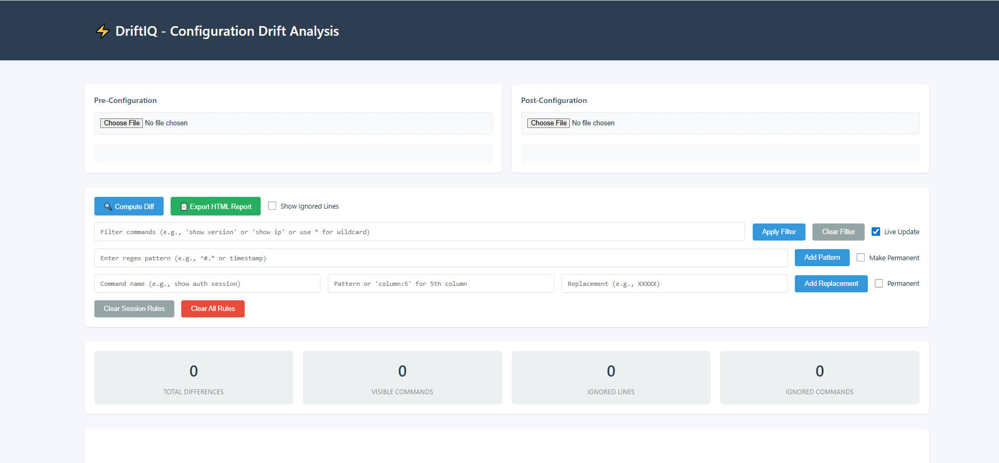
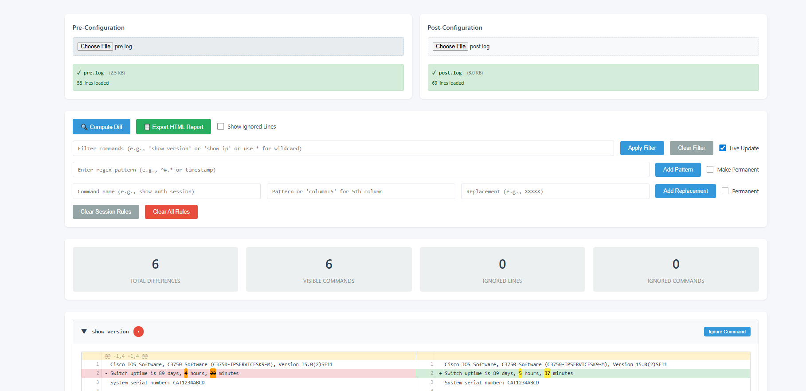
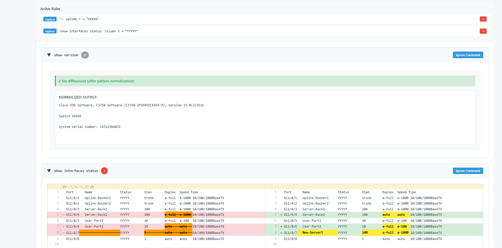
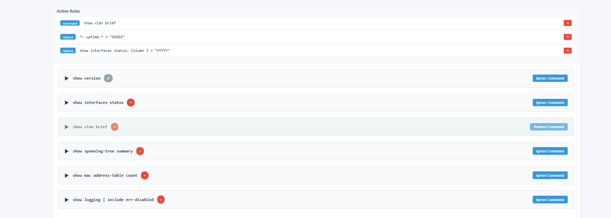
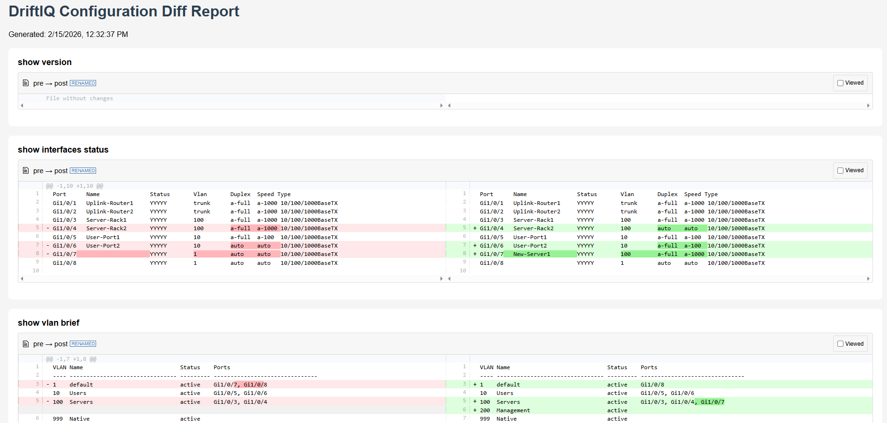

# DriftIQ - Configuration Drift Analyzer


A powerful, browser-based tool for analyzing configuration drift between network devices, systems, or any text-based configuration files. DriftIQ helps you quickly identify what changed, normalize dynamic values, and generate professional HTML reports.

## 🎯 Key Features

### 🔍 Intelligent Diff Analysis
- **Side-by-side comparison** of configuration files
- **Command-based parsing** - automatically separates and compares individual commands
- **Smart pattern normalization** - mask dynamic values like uptime, timestamps, serial numbers
- **Visual color coding** - Green for additions, Red for deletions, Yellow for modifications

### 🎨 Pattern Replacement & Normalization
- **Column-based replacement** - Replace values in specific table columns
- **Regex pattern matching** - Normalize dynamic content across all commands
- **Persistent rules** - Save normalization patterns for reuse
- **Session rules** - Temporary patterns for current analysis

### 📊 Advanced Filtering
- **Ignore specific lines** - Hide irrelevant configuration lines
- **Ignore entire commands** - Skip commands that don't matter
- **Regex patterns** - Filter by complex patterns
- **Show/Hide ignored content** - Toggle visibility on demand

### 📄 Professional Reporting
- **Export HTML reports** - Self-contained reports with all styles and scripts
- **Preserve filtering** - Exported reports maintain your ignore rules
- **Shareable** - Send reports to colleagues without additional dependencies

## 🚀 Quick Start

### Installation

1. Clone or download this repository:
```bash
git clone https://github.com/yourusername/driftiq.git
cd driftiq
```

2. Open `diff-viewer.html` in any modern web browser (Chrome, Firefox, Edge, Safari)

That's it! No installation, no dependencies, no server required.

### Basic Usage

1. **Load Configuration Files**
   - Click "Browse" under Pre-Configuration
   - Click "Browse" under Post-Configuration
   - Or paste configurations directly into the text areas

2. **Compute Diff**
   - Click "🔍 Compute Diff" button
   - View the side-by-side comparison

3. **Apply Filters & Patterns** (Optional)
   - Add pattern replacements to normalize dynamic values
   - Ignore specific lines or commands
   - Toggle "Show Ignored Lines" to verify filters

4. **Export Report**
   - Click "📄 Export HTML Report"
   - Save the self-contained HTML file

## 📖 Usage Examples

### Example 1: Network Device Comparison

Compare switch configurations before and after changes:

```bash
# Load your files
Pre-Configuration: switch-before.txt
Post-Configuration: switch-after.txt
```

### Example 2: Pattern Normalization

Normalize dynamic values that change frequently:

**General Patterns** (applies to all commands):
- Pattern: `uptime.*` → Masks system uptime
- Pattern: `\d{4}-\d{2}-\d{2} \d{2}:\d{2}:\d{2}` → Masks timestamps

**Column-Based Patterns** (for tabular output):
- Command: `show interfaces status`
- Column: `2` (Speed column)
- Replacement: `XXXXX`

### Example 3: Filtering Noise

Ignore irrelevant configuration changes:

**Ignore Lines**:
- Click line numbers in the diff view
- Select "Ignore this line globally"

**Ignore Commands**:
- Click "Ignore Command" button on command headers
- Command won't appear in exported reports

## 📁 File Format

DriftIQ works with any text-based configuration file. For best results with command-based parsing:

```text
command: show version
Cisco IOS Software, Version 15.0(2)SE11
System uptime is 89 days, 4 hours, 22 minutes

command: show interfaces status
Port      Name               Status       Vlan
Gi1/0/1   Server-Port       connected    10
Gi1/0/2   Uplink            connected    trunk
```

Files without "command:" prefix are treated as single configuration blocks.

## 🎨 Screenshots

### Main Interface

*Clean, intuitive interface for loading and comparing configurations*

### Side-by-Side Diff View

*Color-coded differences with line-by-line comparison*

### Pattern Replacement

*Flexible pattern matching and normalization options*

### Ignore Rules

*Granular control over what to include in comparisons*

### Exported Report

*Professional, self-contained HTML reports*

## 🔧 Advanced Features

### Pattern Replacement Rules

**Types:**
- **Column-based**: Replace values in specific column positions
- **Regex-based**: Match and replace using regular expressions

**Scope:**
- **Command-specific**: Apply to specific commands only
- **Global**: Apply to all commands (use `*` as command name)

**Persistence:**
- **Session**: Rules last until page reload
- **Permanent**: Rules saved in browser localStorage

### Color Coding

- 🟢 **Green background**: Entire line added
- 🔴 **Red background**: Entire line deleted
- 🟡 **Yellow highlight**: Partial changes within a line
- ⚪ **Gray + strikethrough**: Ignored content (when visible)

## 📋 Example Files

See the `examples/` directory for sample configuration files:
- `example-pre-config.txt` - Sample pre-configuration
- `example-post-config.txt` - Sample post-configuration

Load these files to see DriftIQ in action!

## 🛠️ Technical Details

- **Framework**: Vanilla JavaScript (no dependencies)
- **Diff Engine**: jsdiff library
- **Rendering**: diff2html library
- **Storage**: Browser localStorage for persistent rules
- **File Size**: Single ~100KB HTML file

## 🌐 Browser Support

- ✅ Chrome 90+
- ✅ Firefox 88+
- ✅ Edge 90+
- ✅ Safari 14+

## 📝 Use Cases

- **Network Engineers**: Compare device configurations before/after changes
- **DevOps Teams**: Track configuration drift in infrastructure
- **System Administrators**: Audit system configuration changes
- **Security Teams**: Review configuration changes for compliance
- **Developers**: Compare environment configuration files

## 🤝 Contributing

Contributions are welcome! Please feel free to submit issues or pull requests.

## 📄 License

MIT License - See LICENSE file for details

## 🙏 Acknowledgments

- Built with [jsdiff](https://github.com/kpdecker/jsdiff) for diff computation
- Powered by [diff2html](https://github.com/rtfpessoa/diff2html) for beautiful rendering

## 📞 Support

For issues, questions, or suggestions:
- Open an issue on GitHub

---

**Made with ❤️ for network engineers and system administrators**
